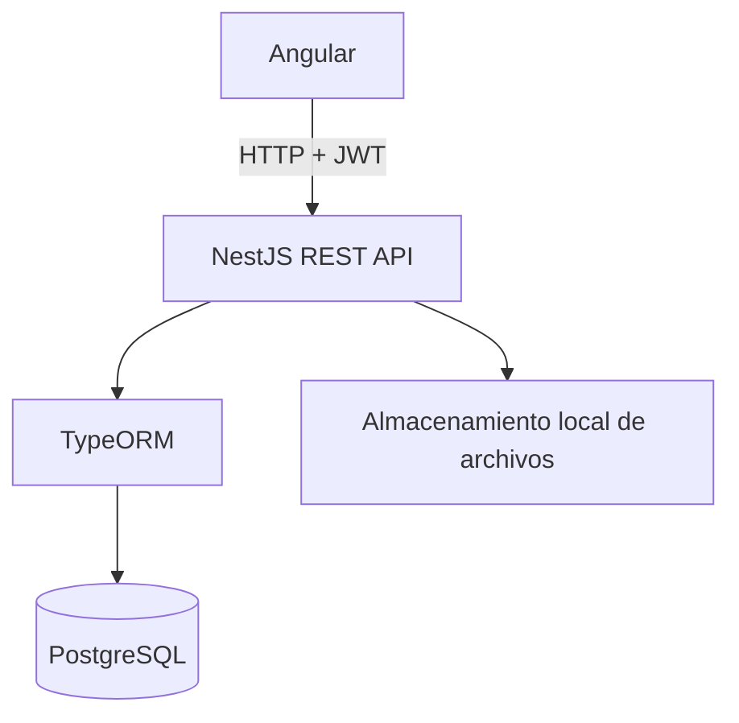

# MANAGIX

> Plataforma académica para la gestión del costeo y seguimiento de procesos de producción en Diseño de Modas.

MANAGIX es un proyecto académico orientado a apoyar los procesos de enseñanza y aprendizaje vinculados con costos y producción en la Carrera de Diseño de Modas. Integra el desarrollo de proyectos de indumentaria, el costeo por versiones, el seguimiento de producción y la generación de fichas técnicas para fines formativos.

## Descripción

La plataforma centraliza información que habitualmente se trabaja de forma dispersa durante el desarrollo de una prenda: medidas, materiales, insumos, maquinaria, orden operacional, costos, evidencias y revisiones. Su propósito es servir como apoyo pedagógico; no se presenta como un ERP comercial del sector textil.

## Objetivo

Apoyar a estudiantes y docentes en la organización, cálculo, seguimiento y documentación académica de proyectos de Diseño de Modas.

## Características principales

- Autenticación con JWT y control de acceso por roles.
- Administración de usuarios, catálogos y parámetros de costeo.
- Proyectos con versiones históricas de costeo.
- Gestión de medidas, telas, insumos, maquinaria y orden operacional.
- Cálculo de costos y conservación de valores aplicados por versión.
- Seguimiento de producción por etapas, evidencias y revisión docente.
- Portal Académico con publicaciones y notificaciones.
- Generación de fichas y reportes PDF para los proyectos académicos.

## Roles del sistema

| Rol | Alcance principal |
| --- | --- |
| **ADMINISTRADOR** | Administra usuarios, catálogos y parámetros generales; consulta la información institucional del sistema. |
| **DOCENTE** | Consulta los procesos académicos, revisa etapas de producción y participa en la configuración autorizada. |
| **ESTUDIANTE** | Gestiona sus propios proyectos, versiones de costeo, evidencias y procesos de producción. |

## Módulos principales

- Autenticación y seguridad.
- Administración, auditoría y configuración.
- Catálogos académicos.
- Proyectos, versiones y costeo.
- Orden operacional y maquinaria.
- Producción, evidencias y revisiones.
- Portal Académico y notificaciones.
- Ficha de Diseño y reportes PDF.

## Tecnologías

| Área | Tecnologías utilizadas |
| --- | --- |
| Frontend | Angular 19, TypeScript, HTML y SCSS |
| Backend | NestJS 11, TypeScript, TypeORM y PDFKit |
| Base de datos | PostgreSQL |
| Seguridad | JWT, Passport y bcrypt |
| Arquitectura | Cliente-servidor mediante API REST |

## Arquitectura general



Las evidencias, imágenes y archivos PDF generados se administran como almacenamiento de ejecución del Backend. No forman parte del código fuente versionado.

## Estructura del repositorio

```text
MANAGIX/
├── Backend/    # API NestJS, entidades, servicios y generación de reportes
├── Frontend/   # Aplicación Angular
└── Docs/       # Material técnico y académico del proyecto
```

## Requisitos previos

- Node.js y npm.
- PostgreSQL.
- Una base de datos PostgreSQL con el esquema MANAGIX preparado para el entorno de trabajo.

## Instalación

Clone el repositorio y prepare cada aplicación por separado:

```bash
git clone <URL_DEL_REPOSITORIO>
cd Managix
```

### Backend

```powershell
cd Backend
npm install
Copy-Item .env.example .env
```

Complete los valores locales de `.env` antes de iniciar el servicio. Nunca suba ese archivo al repositorio.

```bash
npm run start:dev
```

La API se ejecuta, por defecto, en `http://localhost:3000`.

### Frontend

En otra terminal:

```bash
cd Frontend
npm install
npm start
```

La aplicación se ejecuta, por defecto, en `http://localhost:4200`.

## Configuración

El Backend utiliza las siguientes variables de entorno:

```env
DB_HOST=localhost
DB_PORT=5432
DB_USERNAME=postgres
DB_PASSWORD=change_me
DB_NAME=managix_db
PORT=3000
CORS_ORIGIN=http://localhost:4200
JWT_SECRET=replace_with_a_long_random_secret
JWT_EXPIRES_IN=1h
```

El ejemplo seguro se encuentra en [`Backend/.env.example`](Backend/.env.example). La URL de desarrollo de la API para Angular se configura en el archivo de entorno del Frontend.

## Base de datos

MANAGIX trabaja sobre un esquema PostgreSQL controlado. TypeORM se configura con `synchronize=false` y `migrationsRun=false`; por tanto, el ORM no crea ni modifica el esquema automáticamente.

Los scripts SQL históricos y técnicos conservados para referencia se encuentran en [`Docs/sql`](Docs/sql). Revise su alcance antes de ejecutarlos: no constituyen un mecanismo automático de inicialización para todos los entornos.

## Ejecución y validación

```bash
# Backend
cd Backend
npm run build
npm test -- --runInBand

# Producción del Backend
npm run start:prod

# Frontend
cd ../Frontend
npm run build
```

## Seguridad

- Las contraseñas se almacenan mediante hash bcrypt.
- La autenticación se realiza con JSON Web Tokens.
- La API aplica validación de datos y autorización por rol.
- Las credenciales, claves JWT, archivos de ejecución, cargas y respaldos locales se excluyen del control de versiones.

## Reportes

El Backend genera documentos PDF asociados a la información académica de cada proyecto. Los archivos generados se almacenan como recursos de ejecución y no deben versionarse.

## Equipo de desarrollo

MANAGIX fue desarrollado por:

- Melanie Atancuri
- Alisson Ponce
- Estefany Ordoñez

## Contexto académico

Proyecto desarrollado en el contexto académico del **Instituto Superior Tecnológico de Turismo y Patrimonio Yavirac**, para la **Carrera de Diseño de Modas**.

## Estado del proyecto

La plataforma se encuentra en etapa de cierre académico y preparación para defensa. Algunos ajustes funcionales y visuales finales continúan en revisión antes de la publicación definitiva.

## Licencia

Todos los derechos reservados.
